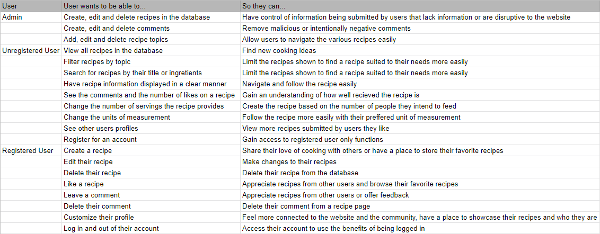
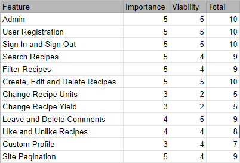
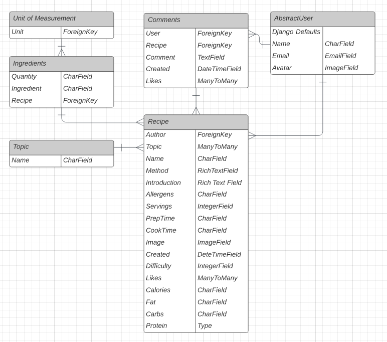
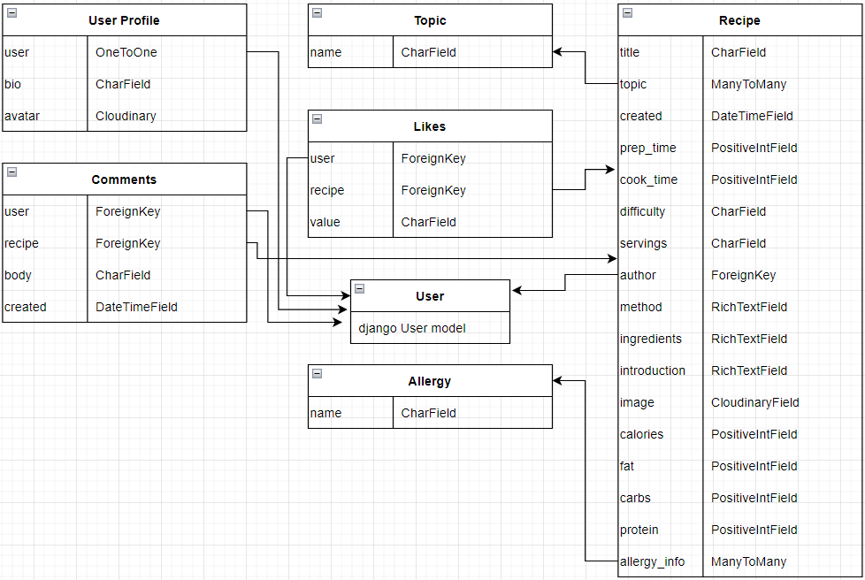

# **Recipeasy - Recipe Sharing Social Platform**

This project is designed to offer a simple and fluid website for cooks of all levels to share their recipe ideas with others, find new inspiring recipes and share their thoughts.

<!--  -->

[Link to Live Project](https://recipeasy-sam-dainton.herokuapp.com/)

This is my 4th Milestone Project on my course with Code Institue. It is meant to showcase my progress as a developer working with the languages I have learned so far but with a clear focus on Python, Django and CRUD operations through a relational database.

This recipe website allows users to share their favorite recipes with a simple and straightforward recipe form, where much of the instructions and ingredients can be styled thanks to the use of CKEditor. Users can like recipes to show their appreciation, leave comments on recipes they appreciate and build a small profile page to showcase all their submitted recipes for other users to view.

## **STRATEGY**

### **Project Goals**

- Develop a recipe website that allows users to share their own recipes and browse or search for new and inspiring recipes to expand their cooking knowledge
- Create an Admin access account on the platform to allow the owner to make the required changes to the data sets in the database
- Produce a secure and comprehensive backend structure, including database hosting any data stored online
- Build a smart and responsive web app to enable users to view displayed information easily
- Handle any errors in such a way to help the user understand the issue and provide clear and responsive feedback on all user operations
- Allow users to have a range of options to find recipes suitable for their cooking skill, serving size and dietary needs.

### **User Demographic**

- All ages
- All genders and ethnicities
- Passionate about cooking and sharing recipes or simply looking for new ideas to spice up their home meals

## **User Stories**

My user stories were broken up into categories based on whether the user is an Admin or if the user holds and account or not.

## **SCOPE**

### **Production Feature Planning Table**

After the initial planning session, an importance viability assessment was performed on all the features suggested and below are the results of this.

Not all users would be able to access all features.

#### **Analysis Conclusion**

After the analysis of the features suggested, I did end up attempting all of the features as time was not an issue of the project and I wanted to persue new learning. 

However, after a great amount of effort I did eventually drop the ability to convert the recipes based on the users preference for its yield and the units of measurement. I was working with htmx to try and achieve the results I wanted and couldn't rely on tutoring when I ran into errors as it is a tool not covered on my course.

I did get quite far with these functions and hope to revisit htmx again in the future as I have gained an understanding and appreciation of how useful it can be to a variety of projects.

## **STRUCTURE**

## Database Schema

To deliver the required functionality, I have used a relational database to store and access any associated data.

Postgres, as provided by Heroku, has been used both during development and in live production.

This diagram shows my original database model idea and the relationship between them.

I found that using an abstract user to be quite a difficult task and later decided to extend the base user model instead, using a function within the models that attached the UserProfile model to the User model when a new user registers to the site. 
My ingredients model changed a lot during the production and ended up including the fields of quantity, unit, other_unit, name and description. For example an ingredient a user might submit would be: 
 - 1bunch Thyme stems seperated
 - 4 Potatoes peeled 
or 
 - 100g Flour  

Bunch would be an other_unit and g was a common unit that would be recognised by an app I was attempting to use called Pint that converts units of measurement. Pint would also recognise a variety of terms for each unit kg, kilos, kilo, kilograms, kilo grams and validate them. I didn't end up using this app as when I got to attempting to convert the units it would keep converting units of liquid such as ml into kilometers instead of cups. I had planned to change this to a forign key later and supply the user with a number of basic options such as kg, g, cups etc. 

Through some trial and error, my final database looks as shown below.

### **Model Descriptions**

**User** - Provided by AllAuth application and contains basic user information including username, email etc.

**UserProfile** - Extends the user model to allow the user to have a profile including a breif introduction and a profile image.

**Topic** - A list of various topics used to filter search results.

**Allergy** - A list of the most common allergy types for users to add to their recipe info.

**Recipe** - Contains all the major information for a recipe that is submitted by a user. It uses ManyToMany fields that are styled like radio buttons on the create recipe page to allow users to attach different topics and allergy types associated to the recipe. It takes positive integer fields for the cooking times and nutritional info which are later displayed as hours and minutes for the time and g for the nutritional info. Difficulty is a CharField but only allows users to select between 3 settings. The CKEditor fields allow users to customize the layout of their ingredients, introduction and method. Lastly, the cloudinary field allows the user to attach an image to their recipe.

**Comments and Likes** - These last two models are related to the user and the recipe models to allow users to interact with recipes they enjoy.

## **SKELETON**

### **Wireframes**

[Link to all the Wireframe designs for this project](readme/assets/wireframes/)

### **Design Decisions**

Bootstrap provides a clean user-friendly appearance to the website which is easy to customise for the situation using its extensive supporting documentation and was used througout the project.

**Colour Scheme**

I designed the colour scheme for this website from the logo that I made.

The colour scheme is high contrast and easily viewable. The color turqoise is said to be associated with meanings such as refreshing, friendly, calming and creativity. I used this as the primary accent color and otherwise kept the color scheme simple and clear to emphasize the feeling I wanted to achieve from the website.

I also used a slight hint of purple on the recipe cards just to give the user a little more feedback as they navigate the recipes.

**Typography**

To give the website a clean and professional look, I chose to use Alegreya and Gentium Book Plus from google fonts.

## **FEATURES**

This is a full, page by page, breakdown of all the features & elements that have been implemented for the first production release.

### **Multi Page Elements**

**Navbar**
- Logo - to establish identity and act as a home button
- "Home" - secondary button linking to home
- "Account" Dropdown Menu which links to:
    - "Login" and "Register" if user is not authenticated, "Logout" and "Update Profile" if user is logged in.
    - "Profile" link which otherwise links user to login page if not authenticated
- "Create Recipe" - Links to the create recipe form but otherwise directs user to login if not authenticated.

**Footer**
- Links to socials for promotion
- Copyright stamp

**Home Page**
- Carousel - The carousel displays 3 rotating images that welcome the user and direct them to interact with different areas of the site. This can be used later to promote new features of the site as they are added
- Search Bar and Catagories - Filters the list of recipes displayed on the home page to the users inputs
- Recipe Grid - Displays basic info of the recipes in the order of most recently created. If the user is the author of the recipe it instead shows buttons that the author can use to either update or delete their recipe
- The recipe grid uses pagination, so if more than 12 recipes are listed then buttons will appear to seperate the next set of 12 recipes to another page

**Create/Update Recipe**
- Displays a form for a user to create their recipe based off the recipe model, excluding the author which is set automatically
- Displays feedback to the user on form submission if any required information is missing
- Locks the submission button whilst the form is processing to prevent the user from submitting multiples of the same recipe

**Recipe Details**
- The first half displays basic info of the recipe and the author
   - The time requirements from the form are processed to display as hours and minutes
   - The authors name and avatar are links that will direct a user to their profile
   - A like button is displayed to allow users to leave positive feedback on a recipe
        - In future this button can also be used to filter users search results based on their likes 
        - Non authenticated users are directed to login/signup if they click the button
   - Non required information such as nutritional values have default messages incase the author left them blank
- The second card displays the ingredients and method of the recipe.
    - It is seperated from the rest to make the information as clear and compact as possible as this is the section a user will be most engaged with
- The comment section allows users to leave praise or feedback on the recipe page
    - Non authenticated users are directed to the login page if they want to leave a comment
    - Authenticated users can click the button to reveal the comment input field
    - Comments are displayed with the users avatar, name and a time stamp of when the comment was made
    - Comments belonging to their respective users display a delete button

**User Profile**
- The user profile page displays introduction information of the selected user and any recipes they have created using the same recipe grid as the home page
- It is mainly inteded to allow recipe authors to manage all of their submitted recipes without having to search through the whole database on the home page
- If the request user clicked someones avatar or name, the page will be of the selected user. If accessing it from the profile link in the navbar, it will be of the request user
- An update profile button is displayed if the profile belongs to the request user
- The avatar and introduction have placeholder information if a user hasn't yet submitted anything

**Delete Confirmation**
- When a user wants to delete a comment or a recipe belonging to them, they are first directed this confirmation page
- If deleting a comment, the user is redirected back to the recipe page they came from
- If deleting a recipe, the user is redirected to the home page

**All Auth**
- All login, signup and related pages are based on the standard django all auth forms and views
- They have been styled and edited slightly to remove certain functionalities such as the account recovery

### **Defensive Programming**

Throughout the building of this project I used the built in [Django Decorator login_required](https://docs.djangoproject.com/en/4.0/topics/auth/default/#the-login-required-decorator) to secure any functions that the User needs to have a verified account to use for example:

    @login_required
    def createRecipe(request):

If an unverified user attempted to access this function, they will be taken to the sign-in page to sign in or create an account.

There are several occasions where part of a function should run or only be access if the user is the author or owner of the content. To facilitate this functionality, I have used simple checks and HttpResponses. This is to prevent a user from accessing the page by navigating to it through the address bar.   

    if request.user != comment.user:
    return HttpResponse('This is not your comment to delete.')

On the front end, these kind of navigation links are hidden from the user by the html

    
    <a href=""><button>Delete Comment</button></a>
    

All admin functions are locked behind the django admin pannel.

If you find any security flaws or issues please feel open to contact me, I do hope to continue to update and use this website for myself.

### **Features for Future Releases**

- Units and servings calculations
- Filter recipes based on the users likes
- Sort recipes by their number of likes
- Email verification
- Replying to a specific comment
- Flagging comments or recipes for missuse to call an admins attention

## **TESTING**

View the [Testing Document](readme/assets/testing.md)

## **BUGS AND ISSUES**

This is a table of the major bugs and issues that I experienced when building this project.

| **Bug ID** | **Description of Bug** | **Problem** | **Fix/Solution** |
|---|---|---|---|
| 1 | Slugs | Using title to navigate urls for recipes instead of id's | Decided against using slugs, I wanted the recipe title to be visible in the address bar |
| 2 | Topics | List of topics was not displaying on the front end | Topics had to be itterated through for each topic |
| 3 | 'All' topics | 'All' topics button returned nothing | Check if the search query contains nothing ie 'All' and return all if so |
| 4 | Signup with email | filling in the email field when registering returns 'Exception Type:ConnectionRefusedError' | Added EMAIL_BACKEND = 'django.core.mail.backends.console.EmailBackend' to settings.py |
| 5 | Navbar Dropdown | Dropdown list for the navbar not working on allauth pages | Added bootstrap javascript import to allauth css |
| 6 | RichTextField | CKEditor fields on the create recipe page not working | '{{form.media}}' added to html |
| 7 | Cloudinary | Cloudinary fields not uploading images | 'request.FILES' added to related view post methods|
| 8 | Pagination and Search | Adding pagination was overriding browse and search functions | Added if statement to check if there was a search query or not |
| 9 | User Profile | Couldn't add bio or avatar to users except throug the admin panel | Function in models to add bio and avatar fields to the user model upon registering for an account |
| 10 | Search and Browse | Searching recipes returned multiple instances of the same recipes | Added .distinct() to the returned list |
| 11 | Database Maintainance | Heroku changed my database to a COPPER_URL | Added new copper url config vars to env.py and settings.py |
| 12 | Model Forms | Testing the ManyToMany fields would return 'not a valid option' | setUp lists for the many to many fields and used list item values instead of their names.|
| 13 | Recipe Form Submit | Clicking the submit button on a recipe form submits the recipe multiple times | Added 'onclick="this.disabled=true' to the submit button |

## **DEPLOYMENT**

In order to deploy the project yourself both for the development and live versions of this project, images have been hosted using a cloudinary API and the database is stored through Heroku PostgreSQL. Changes will need to be made if you intend to use other hosting services.

### Local Deployment

**Prerequisites**
Python 3 or higher
Pip 3
Git 

**Cloning the Repository using Git**
- Open the repository, click the code button
- Selet HTTPS and copy the clone URL
- In your command line type "git clone" and paste in the copied URL

**Cloning the Repository using GitPod**
- Navigate to the repository page on GitHub
- Click the "GitPod" button in the top right of the repository.

Once the project is open you will need to install the requirements.

    pip3 install -r requirements.txt

To access admin features you will also need to create a super user.

    python manage.py createsuperuser

**Development Environment Variables**
- DEVELOPMENT should be set to true
- SECRET_KEY is required for django
- DATABASE_URL is required for the models database
- CLOUDINARY_URL is required for the image uploads and storage

If you are using Heroku you may also need to add a variable of DISABLE_COLLECTSTATIC with the value of 1 to your config vars.

The keys for these should be written into an env.py file and referenced in the settings.py where appropriate.

Once your databases are linked you will need to migrate the models.

    python manage.py makemigrations
    python manage.py migrate

Commit all changes to the repository and run the server.

**Deployment Using Heroku**
- Create a new app.
- Add a Postgres database in the resources tab of your new app.
- In the config vars you will need to add the values for the various variables.
    - For me these variables are:
    - HEROKU_POSTGRESQL_COPPER_URL
    - SECRET_KEY
    - CLOUDINARY_URL

When deploying a live version of the site, remember to change the debug mode to False in your settings.

## **TECHNOLOGY USED**

 Languages and Libraries

- [Django](https://www.djangoproject.com/) - Python Framework
- [HTML5](https://developer.mozilla.org/en-US/docs/Glossary/HTML5) - Programming Language
- [CSS 3](https://developer.mozilla.org/en-US/docs/Web/CSS) - Programming Language
- [JavaScript](https://developer.mozilla.org/en-US/docs/Web/JavaScript) - Programming Language
- [Python](https://www.python.org/) - Programming Language
- [Bootstrap v5](https://getbootstrap.com/) - Library Import
- [Google Fonts](https://fonts.google.com/) - Typography Import
- [Font Awesome](https://fontawesome.com/) - Icon provider

 Third Party Tools

- [CKEditor](https://ckeditor.com/) - Rich Text Fields

 IDE and Version Control

- [Git Pod](https://gitpod.io/) - IDE (Integrated Development Environment)
- [Github](https://github.com/) - Cloud based hosting service to manager my Git Repositories
- [Code Institute GitPod Template](https://github.com/Code-Institute-Org/gitpod-full-template) - Provides GitPod extensions to help with code production

 Validation and Testing

- [JavaScript Validator](https://beautifytools.com/javascript-validator.php) - Validating JS code
- [Am I Responsive?](http://ami.responsivedesign.is/) - Webpage Breakpoint visualizer and image generator
- [Black](https://black.readthedocs.io/en/stable/)- Code Formatter
- [W3C CSS Validation Service](https://jigsaw.w3.org/css-validator/)
- [Browser Stack Responsive Design Tester](https://www.browserstack.com/responsive)
- [Media Genesis RESPONSIVE WEB DESIGN CHECKER](https://responsivedesignchecker.com/)
- [Chrome Dev Tools](https://developer.chrome.com/docs/devtools/)
- [Lighthouse](https://developers.google.com/web/tools/lighthouse)
- [pylint](https://pylint.org/)

## **CREDITS**

- Much of the html was built, extending off of bootstrap . 
- I followed a guide by Alice Campkin to style my ManyToMany fields into radio buttons found 
- A lot of my learning and understanding of the backend was guided by videos from  and 

### **Resources**

Other resources that I used for my learning include
- [Code Institute Course Content](https://courses.codeinstitute.net/) - Code fundamental learning platform
- [Stack Overflow](https://stackoverflow.com/)
- [W3Schools](https://www.w3schools.com/)
- [Django Documentation](https://www.djangoproject.com/)

### **Media**

Carousel Images sourced from:

- [Pexels](https://www.pexels.com)

### **Acknowledgements**

I would like to say a big thank you to my CI mentor Rahul, the CI Slack Community and the tutors who I got to know a lot better due to the complexity of this project! 
Sean, Ed, Alex, Gemma, Rebecca and Franciska
A big thank you to Nick Lennon who huddled with me multiple times
